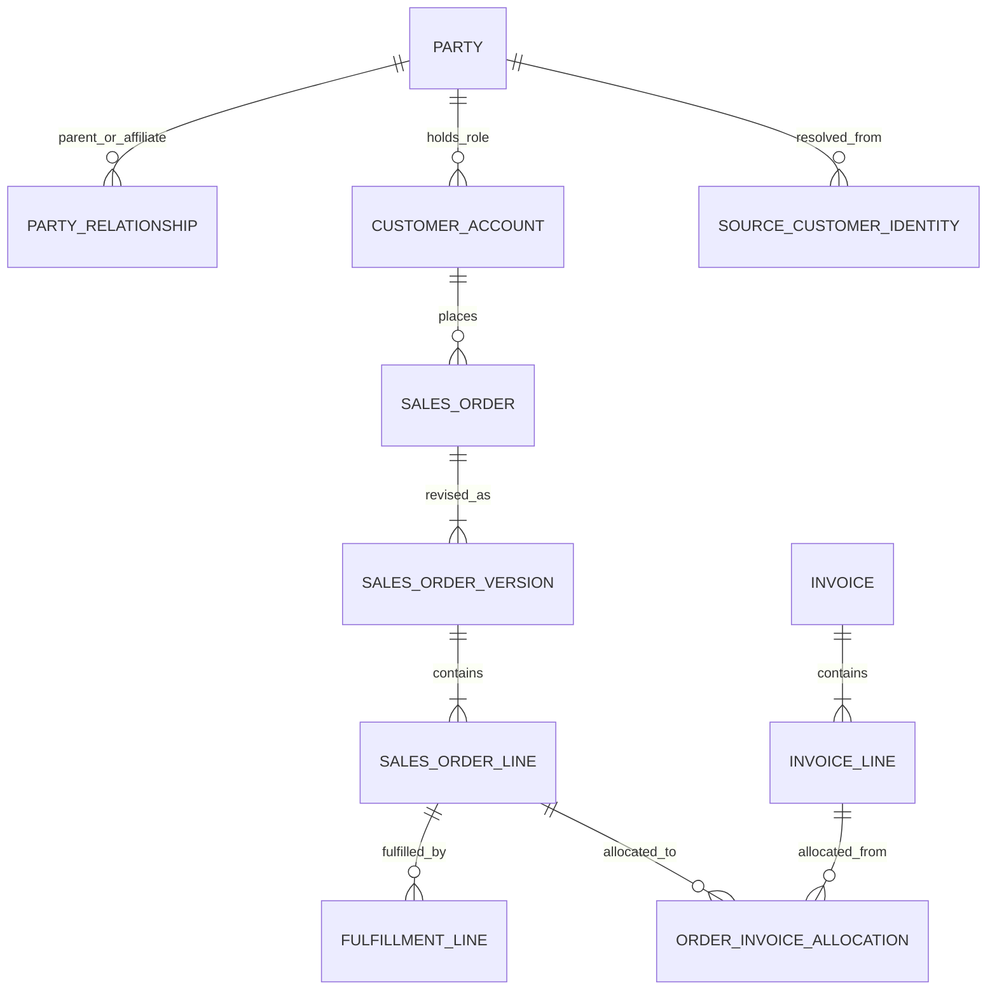

# `modeling-data` 独立 GREEN／边界评估

## 总结

**GREEN：无阻断缺口。** 测试 A 应由 `modeling-data` 主导；技能正文与手册足以把 CRM、订单、计费的术语、粒度和客户标识冲突推进为可开发、可测试、可批准的模型包。测试 B 不应由本技能主导，应路由至 `designing-data-architecture`。

## 测试 A：B2B 客户／订单域四周实施骨架

### 任务书与方案选择

- 业务结果：支持客户 360、订单履约、订单—开票对账三个 P0 用例，回答哪个法律主体／账户下了哪版订单、哪些订单行被履约和开票。
- 范围：CRM、订单、计费三源的客户身份／层级、账户、订单版本／行、履约、发票行及分摊。
- 非范围：替换源系统、完整企业 MDM、企业键回写、全部历史清洗和收入确认；若为 P0 硬依赖，则由赞助人扩围或延期。
- 层级：第 1 周以 CDM 对齐业务边界，第 2 周以 LDM 固定粒度／键／基数／时态／规则，第 3 周仅为端到端薄切片形成关系型 PDM，第 4 周回归、签署和发布。
- 方案：客户身份与集团层级用时态交叉引用／关系表达；订单—发票用分摊实体表达多对多；不把三套源直接拼成宽表。

### 术语、模型与决策权

| 冲突 | 代表性设计 | 决策人／阻断点 |
|---|---|---|
| “客户”是集团、法人还是账户 | 分离 `Party`、`PartyRelationship`、`CustomerAccount` 和角色 | 客户数据 owner；CDM 签署前 |
| 三源客户 ID 冲突 | 企业代理键不替代源 ID；保存源、ID、有效期、匹配规则／证据／置信度 | 跨域 owner／治理；自动合并前 |
| “订单”何时成立及如何改单 | 分离 `SalesOrder`、`SalesOrderVersion` 和状态事件 | 订单 owner；LDM 签署前 |
| 下单、履约、开票金额混用 | 明确命名各金额；订单行—发票行分摊保存数量、币种、规则版本 | 订单／财务 owner；PDM 冻结前 |

术语卡须含定义、包含／排除、例子／反例、粒度、唯一范围、生命周期、权威来源、owner、有效日期和版本。建模师呈现选项和影响，不自行裁决业务语义。

| 元素 | 粒度／键 | 核心规则 |
|---|---|---|
| `Party` | 一个组织／法律主体；`party_sk` | 集团关系不等于身份合并；合并／拆分可逆、可审计 |
| `SourceCustomerIdentity` | 一个源客户 ID 在一段有效期内的解析；源＋ID＋`valid_from` 唯一 | 低置信度只进人工队列，不自动合并 |
| `SalesOrderVersion` | 某订单一次可识别修订；订单内版本号唯一 | 事件时间与摄取时间分离，不以当前状态覆盖历史 |
| `SalesOrderLine` | 某订单版本的一条业务行；版本内行号唯一 | 数量、单位、原币金额、税／折扣口径和可加性明确 |
| `OrderInvoiceAllocation` | 一条订单行与一条发票行的一次分摊 | 支持一对多／多对一，按币种、数量、金额和舍入规则对账 |

PDM 必须带代理键、源追踪、业务有效期、摄取／批次信息及适用的唯一、空值、检查和引用约束。LDM 用完整业务名；PDM 用 `snake_case` 和批准后缀。金额伴随币种与口径；时间区分业务事件、源更新和摄取；空值区分未知、不适用、未提供和被遮蔽。

### 追溯、阶段门与验收

每个 P0 建立双向链路：`需求 → 术语/规则 → CDM → LDM 实体.属性 → PDM 表.列 → 源字段 → 转换/匹配 → 质量规则 → 测试 → 批准/版本`。

| 周次 | 最小交付物 | 出口证据 |
|---|---|---|
| 1 | 任务书、需求、术语 v0.1、CDM v0.1、三源画像、冲突／问题日志 | 赞助人批范围；owner 确认冲突和裁决日期；样本与 SME 可用 |
| 2 | CDM 签署版、LDM v0.8、定义卡、粒度／键／基数、源目标映射 | 创建、改单、取消、合并／拆分、部分履约、拆分／汇总开票走查通过；P0 追溯完整 |
| 3 | PDM／DDL v0.8、转换／代码映射、字段血缘、样本装载及测试报告 | 工程可独立建表装载；身份和财务差异可解释；无未接受阻断项 |
| 4 | 三层模型 v1.0、同版本字典／映射／测试／决定、发布与限制 | 业务、数据、工程、安全签署；实现—PDM 无未批准漂移；遗留风险有 owner 和期限 |

验收最小证据：P0/P1 需求追溯率 100%；核心实体均有粒度、键、关系、owner 和来源；身份匹配报告覆盖、误并／漏并和人工队列；订单—发票做记录级及汇总级对账；新增、更新、删除、迟到、更正、重跑、合并后拆分和历史时点重建通过；代表性负载和允许／拒绝访问测试通过。

图、字典、映射、DDL、规则和测试须同版本。改变粒度、键、含义、单位、状态语义或删除字段属于破坏性变更，必须有影响分析、并行版本／弃用、回填、迁移测试和回退。第 2 周末未裁决口径不得固化为技术默认，只能由赞助人批准并列口径、隔离或移出首期。

### 输出契约覆盖证据

| 输出契约 | 本方案证据 | 判断 |
|---|---|---|
| 范围／用例；层级／方案 | 三个 P0、非范围、CDM→LDM→薄切片 PDM | 覆盖 |
| 需求／术语；模型图／定义 | 冲突表、术语卡、ER 图和五个元素定义 | 覆盖 |
| 粒度／键／关系／规则；命名标准 | 元素表、时态身份、多对多分摊、物理命名规则 | 覆盖 |
| 纵向及源—目标追溯 | 完整追溯链、源画像、映射及测试 | 覆盖 |
| 开放问题；评审／批准 | 冲突日志、具名 owner、四个阶段门 | 覆盖 |
| 变更／版本；质量／验收 | 同版本模型包、破坏性变更控制、数据及运行证据 | 覆盖 |

**覆盖性：GREEN。** 正文给出完整输出契约；手册给出任务书、定义卡、追溯矩阵、评审清单、变更记录、角色、阶段门和指标，无关键产物缺失。

**可执行性：GREEN。** 技能可裁剪为四周薄切片，并要求用实际数据画像、样本装载、场景走查、记录级对账、代表性负载和逆向比较验收；语义未裁决或平台事实未知会被阻断／降范围，不以 ER 图完成冒充可实施。

## 测试 B：跨集团目标数据架构、系统／数据流蓝图和迁移路线

**`modeling-data` 不应主导；应路由至 `designing-data-architecture`。** 请求关注跨集团主题域、系统责任、权威源、数据流、目标／过渡状态和迁移依赖，不要求实体、属性、键、粒度或表结构。架构技能应产出当前／目标／过渡架构、能力—数据和系统责任视图、数据流／血缘、ADR、符合性及按能力／数据依赖排序的路线图。

`modeling-data` 仅在后续提供概念主题域／共享语义反馈，或在某领域进入实施波次后细化 CDM／LDM／PDM。若由本技能主导，会过早下钻字段，并遗漏跨系统过渡、复用／替换／退役和路线依赖。

## 缺口及严重级别

P0＝阻断正确路由或可验收交付；P1＝高概率导致不可实施／错误批准；P2＝项目需自行补充但不阻断结果。

| 级别 | 缺口 | 证据／影响 |
|---|---|---|
| P0 | 无 | 测试 A 可形成完整模型包；测试 B 路由明确。 |
| P1 | 无 | 未发现职责错置或实施／批准闭环缺失。 |
| P2 | 无四周快速路径模板 | 有阶段门但无按周最小集，短周期项目需自行裁剪。 |
| P2 | 质量评分无统一量表／否决模板 | 要求分项证据和分数，但项目仍需定义量表、阈值和否决条件。 |
| P2 | 代表性样本／金样本规则偏弱 | 已要求画像和代表性数据，但缺正常／边界／异常分层及金样本维护模板。 |
| P2 | 主数据运营升级触发不够显式 | 宜明确持续匹配、人工裁决、合并／拆分发布或回写出现时，由 `managing-reference-and-master-data` 主导运营能力。 |

**最终判定：GREEN（无 P0／阻断缺口）。** P2 均为交付加速与一致性增强，不影响覆盖、四周可执行性或测试 B 的正确路由。

## 复核：这些 P2 是否关闭

| 原 P2 | 差异证据 | 复核结论 |
|---|---|---|
| 无四周快速路径模板 | 新增四周最小路径，逐周规定任务书／CDM、LDM／追溯、薄切片 PDM／映射／装载、回归／同版本发布，并规定未裁决语义的处置 | **已关闭** |
| 质量评分无统一量表／否决模板 | 新增 0–4 统一量表、发布前权重／阈值，以及需求覆盖、结构正确、模型—数据一致为 0 分或阻断项未关闭时的一票否决；同时记录评分人、证据、整改和复评日期 | **已关闭** |
| 代表性样本／金样本规则偏弱 | 新增正常、边界、异常、金样本四层模板，含选择规则、用途、版本／Owner、预期结果与批准 | **已关闭** |
| 主数据运营升级触发不够显式 | 新增持续匹配、人工裁决队列、合并／拆分发布、黄金记录维护或源系统回写时，由 `managing-reference-and-master-data` 主导；本技能保留结构与规则契约 | **已关闭** |

**复核结论：四个 P2 全部关闭；未引入新的 P0、P1 或 P2。最终状态保持 GREEN。**
